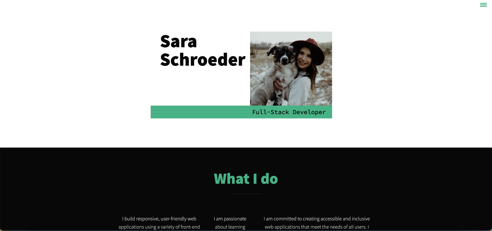

# Portfolio

## Table of Contents
* [Descriptions](#description)
* [Usage](#usage)
* [Credits](#credits)
* [License](#license)
* [Questions](#questions)

## Description

I was able to make and design my own portfolio with an about me section, my projects section, and contact information. I built this project to have everything on one page and for other developers to learn about me and look at what my capabilities are.

## Usage

## Credits

[Sara Schroeder](https://github.com/saraschroeder)

## License

[MIT](https://choosealicense.com/licenses/mit/)

## Questions

If you have any questions, please contact me at [sara.schroeder00@gmail.com](mailto:sara.schroeder00@gmail.com). 

Please find my GitHub here!
[saraschroeder](https://github/saraschroeder)